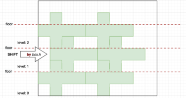
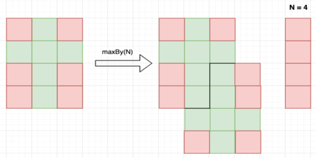
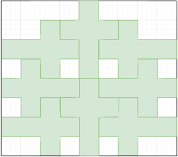

### HOW TO RUN

Service: `./gradlew run`  
Tests: `./gradlew test`  
Docker: `docker-compose up`  

### DESCRIPTION

#### -> SERVICE <-
Service is divided into two layers:
- <b>API</b> - <i>Responsible to handle all the HTTP activities, including: validation and serialization.</i>
 
- <b>CNC</b> - <i> Represent the main CNC program logic and domain entities.</i>

#### -> ALGORITHM <-

The goal is to cut as much as possible amount of the boxes from the sheet, with minimizing waste. 
I consider this problem as NP-complete, specifically variation of <i>"2D Bin Packing Problem"</i>.

<b>Based on time constraints</b> I decided to go with the simple approach and found some box layout feasible to implement:
  

- Sheet space iterated by levels (or rows).
- Each level has a floor (<i>filled height</i>) on which box contours can be placed.
- Contours can be shifted in intermediate level if sheet width has enough space.
- In worst case, if level shift is not possible, contours will be places sequentially one by one.

This layout is easy to implement and in more cases it gives an increase of boxes amount and reduce waste. 
Also, it does not require of box contour rotation support.

### WHAT NEXT

#### -> Algorithm <- 
Initially, I thought about using some of the variations of the <i>"2D Bin Packing Problem"</i> solutions, such as:  
<i>"Floor Сeiling No Rotation"</i>, <i>"Knapsack 0-1"</i>, <i>"First Fit Decreasing High"</i>, <i>etc</i>.

But, in case of <i>"2D Bin Packing Problem"</i> there are lots boxes with different sizes,   
which should be placed to fill as much space as possible. So, all the solutions aimed to solve multiple boxes problem.

I would try to continue with <b>greedy approach</b>. 
Represent each box contour as a rectangle, on each stage, find a best place on a sheet by  
the number of overlapped empty rectangles spots with other contours.  

<b>Or</b>, thinks about some specific layout which improves the chosen one.  
<i>For instance</i>:   

#### -> CNC Translator <- 
Currently, if two contours has same edge, CNC machine will not skip it (IDLE GOTO) for the second contour.
The implementation might be in tracking of all previous cuts ( `set<Cut>` ), in request session,  
and before next one - check has it already been done (`set<Cut>.contains(curr_cut) -> O(1)`) to skip it.

This improvement has direct business impact on a time of sheet processing.